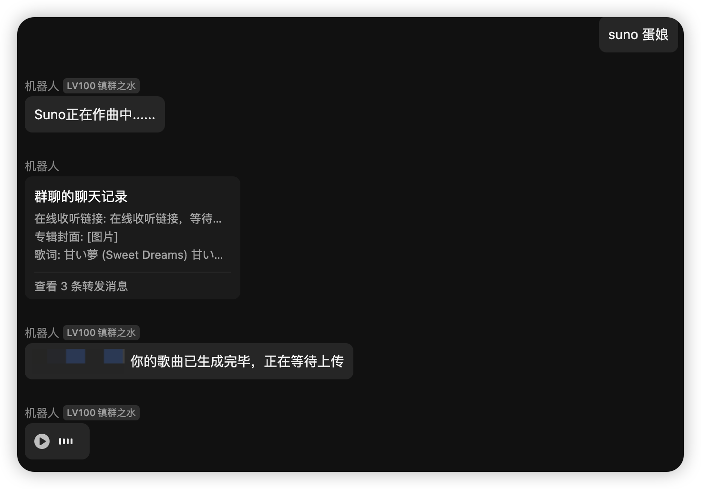
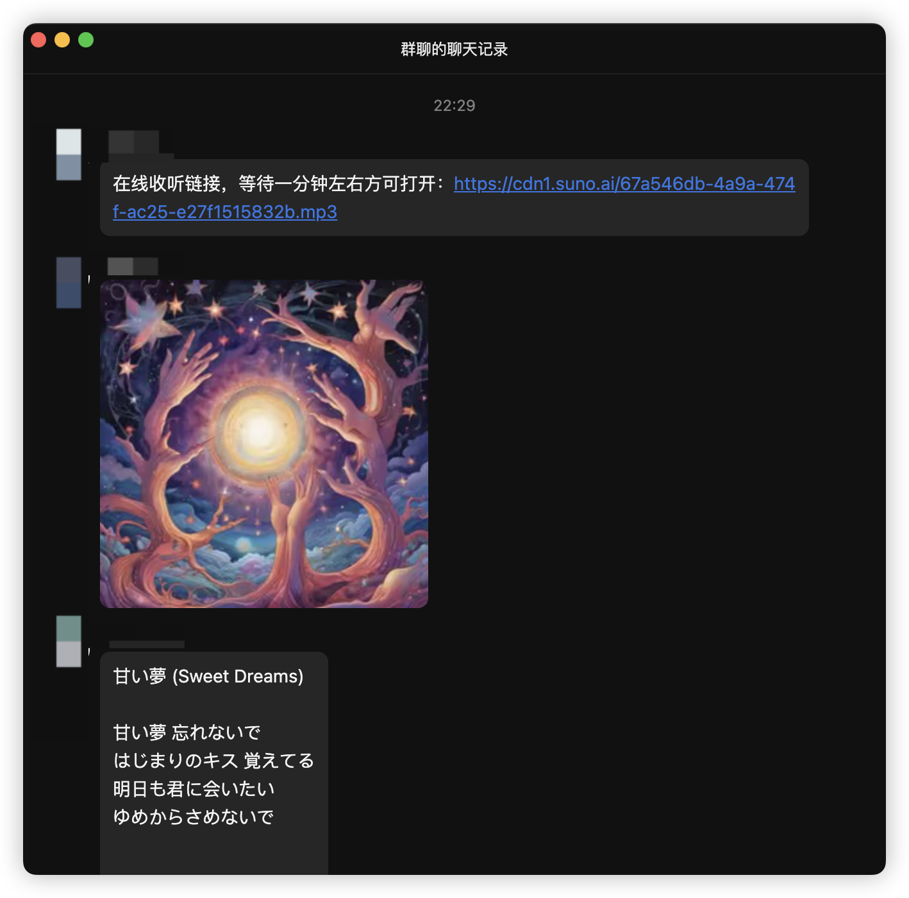

<div align="center">
  <a href="https://v2.nonebot.dev/store"></a>
  <br>
  <p></p>
</div>

<div align="center">

# nonebot-plugin-suno
</div>

# 介绍
- 自用的Suno AI作曲插件。
- 修改自 https://github.com/imyizhang/Suno-API

# 效果
 

# 配置文件

必选内容: 在Bot根目录下的.env文件中填入Suno的cookies信息：

```
suno_token = xxxxxxxx
```

# 使用方法
- 主题作曲：suno 主题
- 歌词作曲： 歌词作曲 歌词##音乐风格
